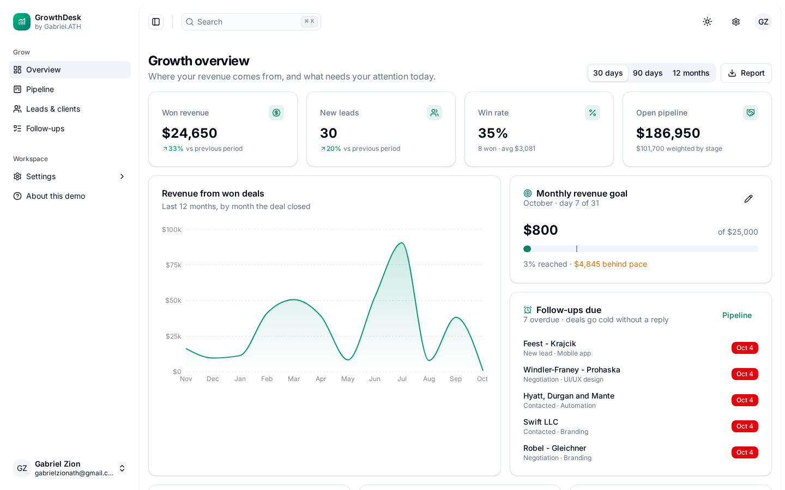
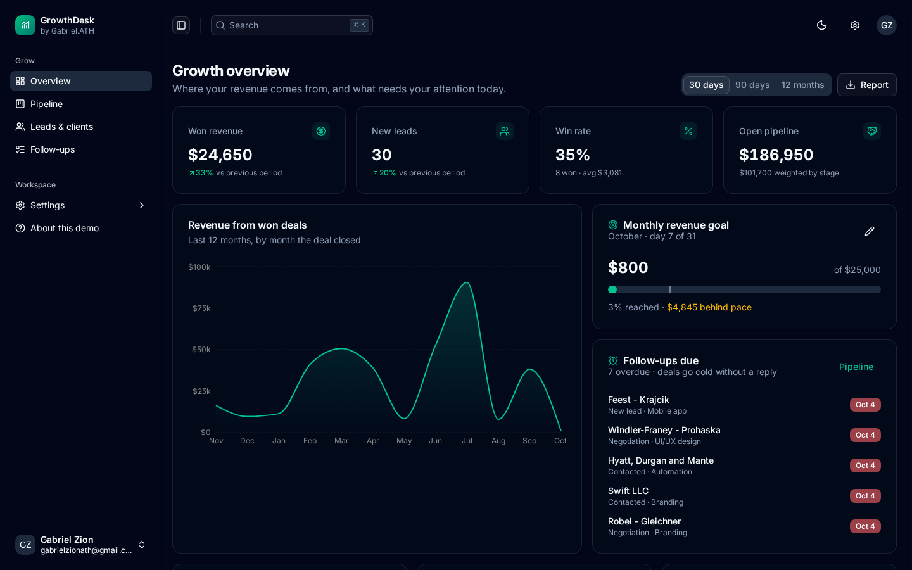

# GrowthDesk

**A lightweight CRM and growth dashboard for agencies, studios and service businesses.**

Most small businesses track leads in a mix of WhatsApp chats, inboxes and spreadsheets, so deals go cold and nobody knows which marketing channel actually brings in money. GrowthDesk puts every enquiry, deal and follow-up in one clean workspace and answers the questions owners ask every week:

- How much did we close this month, and are we on track for our goal?
- Which channels bring in leads that actually turn into paying clients?
- Who do we need to call back today?

**Try it:** clone the repo and run it locally in a couple of minutes (see [Run locally](#run-locally)). It opens in demo mode with fictional sample data, so there is nothing to sign up for and no backend to configure.



## Features

### Growth overview
- KPI cards for won revenue, new leads, win rate and open pipeline, each compared with the previous period
- 30-day / 90-day / 12-month range switcher
- Revenue-by-month area chart based on the date each deal was actually closed
- Lead sources with lead count and win rate per channel, a stage-by-stage pipeline breakdown and revenue by service
- **Monthly revenue goal** with a progress bar, a "where you should be today" marker and an on-track / behind-pace indicator. The goal can be edited inline and is saved.
- **Follow-ups due** panel that highlights overdue call-backs
- One-click **CSV report** for the selected period: KPIs, sources and monthly revenue

### Sales pipeline
- Kanban board with six stages (New lead → Contacted → Proposal sent → Negotiation → Won / Lost)
- Drag-and-drop between stages, with a deal count and total value on every column
- Keyboard accessible cards (Tab + Enter opens a deal)
- Overdue follow-up dates are flagged on the card
- Won and Lost dates are recorded automatically when a deal moves, and cleared if it is reopened
- Instant search across company, contact, service and source

### Leads & clients
- Sortable, filterable table (stage, service, source) with free-text search across company, contact and email
- Bulk select and delete
- **CSV export** of exactly what is filtered. Exported values are escaped against spreadsheet formula injection.
- Add and edit leads in a validated form (zod + react-hook-form): required fields, email format, deal value limits and notes

### Follow-ups
- Task list for calls, emails, proposals and onboarding steps, with status, priority and filters

### Workspace
- Light, dark and system themes, RTL support, collapsible sidebar and a ⌘K command palette
- Data is persisted in `localStorage`, so the demo works offline and nothing leaves the browser
- "Reset sample data" on the About page

| Pipeline | Leads |
| --- | --- |
|  |  |
| **New lead form** | **Dark mode** |
|  |  |

## Tech stack

- **React 19 + TypeScript**, built with **Vite**
- **TanStack Router** (hash history for static hosting) and **TanStack Table**
- **Tailwind CSS v4** with shadcn/ui and Radix primitives
- **Zustand** with the `persist` middleware for state and storage
- **Recharts** for charts
- **Zod** + **React Hook Form** for validation
- **Vitest** browser-mode tests with Playwright
- **GitHub Actions** for lint, tests and build checks on every push

## Project structure

```
src/
  features/
    crm/             # leads domain: types, sample data, metrics, pipeline, leads table, lead form
    dashboard/       # growth overview, KPI cards, goal card, revenue chart
    tasks/           # follow-ups
    about/           # demo info + reset
  stores/crm-store.ts  # persisted Zustand store
  routes/            # file-based routes (TanStack Router)
```

The business logic in `src/features/crm/lib/metrics.ts` (period comparison, win rate, weighted pipeline, monthly revenue and CSV generation) is made of pure functions with unit tests, so it can be moved to a backend unchanged.

## Run locally

**Requirements:** Node.js 20 or newer and pnpm (`npm install -g pnpm` or `corepack enable`).

```bash
git clone https://github.com/gabrielolarinre74-pixel/growthdesk.git
cd growthdesk
pnpm install
pnpm dev
```

Then open http://localhost:5173.

### Demo mode

The app starts with fictional sample data so every screen (Overview, Pipeline, Leads and Follow-ups) has something to show. Everything you add or change is saved in your browser's `localStorage`. Nothing is sent to a server. To start over, use **Reset** in the About page.

### Other commands

```bash
pnpm test:browser:install   # once, downloads the headless browser used by the tests
pnpm test
pnpm lint
pnpm build
pnpm preview
```

`pnpm build` writes a static site to `dist/`, and `pnpm preview` serves it. No environment variables or API keys are needed (see `.env.example`).

## Deployment

The production build is a static site, so `dist/` can be hosted on Vercel, Netlify, Cloudflare Pages, S3 or any static host. GitHub Actions (`.github/workflows/ci.yml`) runs lint, tests and the build on every push and pull request. A GitHub Pages workflow is included, but it is turned off and only runs if someone starts it by hand.

## Roadmap

- Supabase or Postgres backend with team accounts
- Email and WhatsApp reminders for due follow-ups
- Lead capture form embeddable on a client website

## License

MIT. See [LICENSE](LICENSE).

---

Designed and developed by **Gabriel Zion** · [Gabriel.ATH](https://gabrielzion-portfolio.vercel.app). Websites, apps, automation and UI/UX for growing businesses.
