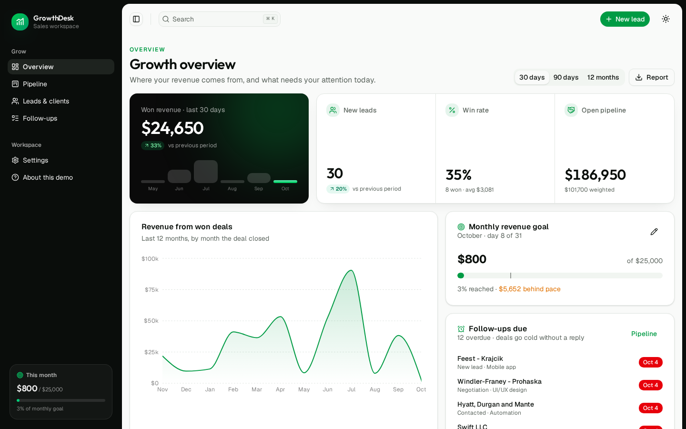
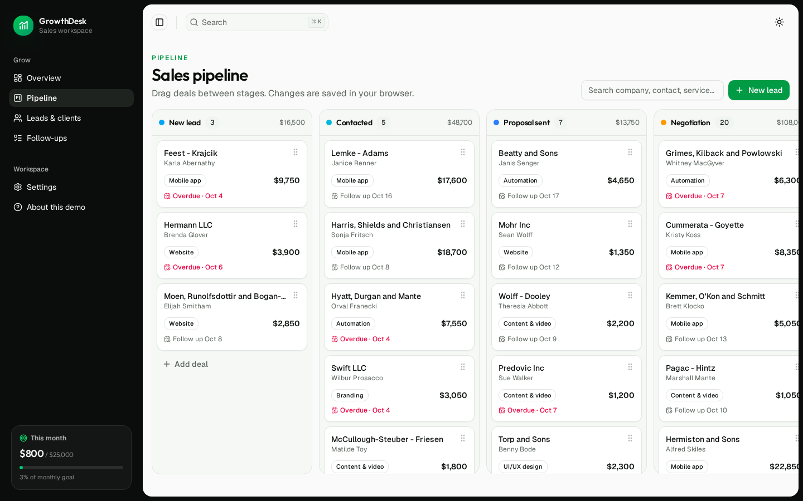
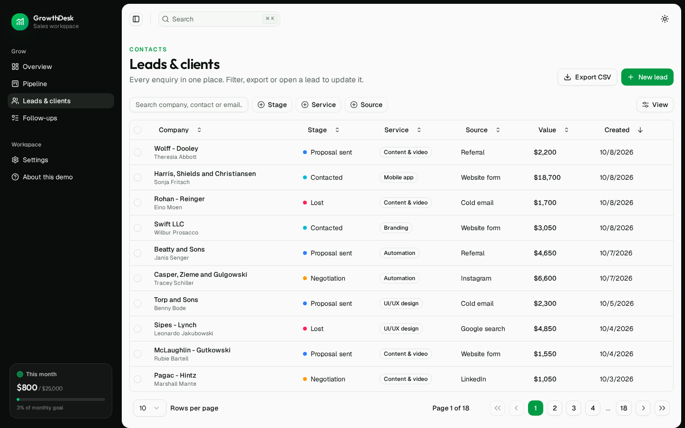
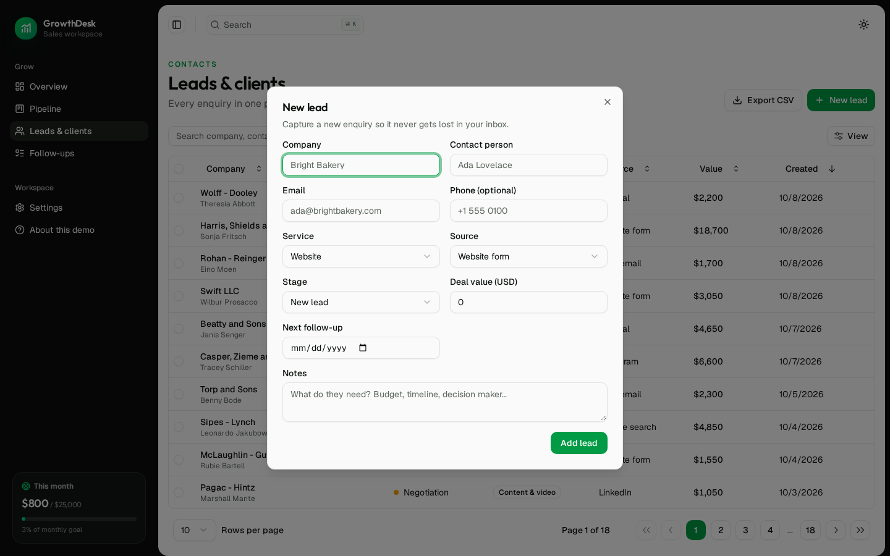
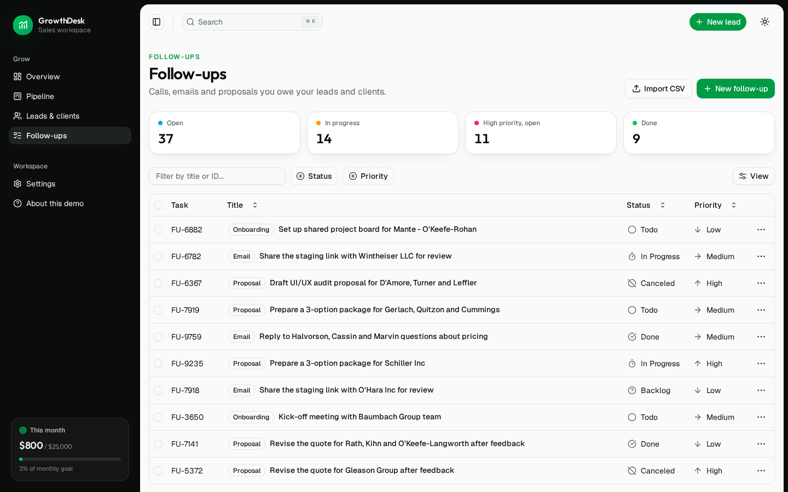
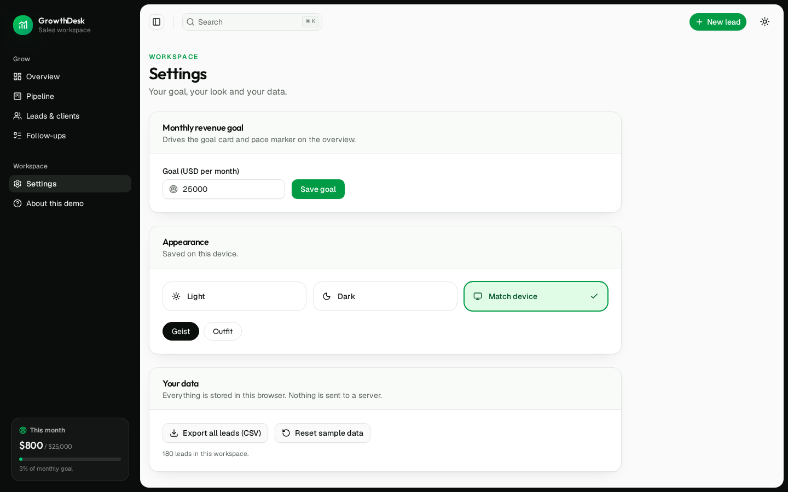
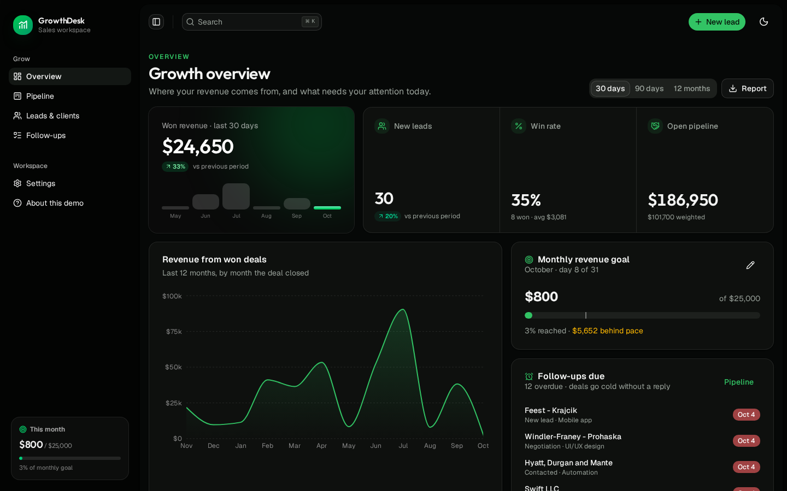
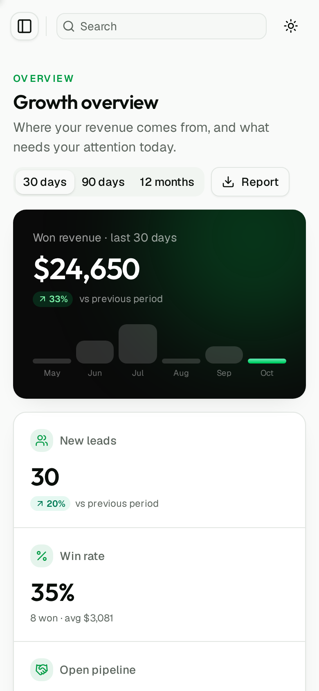

# GrowthDesk

**The sales workspace for agencies, studios and service businesses: every lead, deal and follow-up in one calm place, with a revenue goal you can actually see.**

Small teams lose money in the gaps: an enquiry that sat in an inbox, a proposal nobody chased, a marketing channel that looked busy but never closed. GrowthDesk gives owners one screen that answers the weekly questions:

- How much have we closed this month, and are we on pace for the goal?
- Which channels bring leads that turn into paying clients?
- Who are we supposed to call back today?

It opens in **demo mode** with fictional sample data, so you can explore every screen without signing up or configuring a backend. See [Run locally](#run-locally).



## Features

**Overview**
- Featured revenue card for the selected period, with change versus the previous period and the last six months as mini bars
- KPI strip: new leads, win rate (with average deal size) and open pipeline (raw and stage-weighted)
- 30-day, 90-day and 12-month ranges
- Revenue-by-month chart based on the date each deal closed
- Monthly goal card with a "where you should be today" pace marker and an inline editor
- Follow-ups due, with overdue call-backs flagged
- Lead sources, pipeline breakdown and revenue by service
- One-click CSV report for the selected period

**Pipeline**
- Six-stage board (New lead, Contacted, Proposal sent, Negotiation, Won, Lost) with drag and drop
- Count and value per stage; overdue follow-up dates flagged on each card
- Won and lost dates are stamped automatically and cleared when a deal is reopened
- Instant search across company, contact, service and source; keyboard accessible cards

**Leads & clients**
- Sortable table with stage, service and source filters plus free-text search
- Validated lead form (zod and react-hook-form) with email, value and date checks
- Bulk delete, and CSV export of exactly what is filtered (values are escaped against spreadsheet formula injection)

**Follow-ups**
- Calls, emails, proposals and onboarding steps with status, type and priority, saved in the browser
- Summary strip: open, in progress, high priority and done
- Import follow-ups from a CSV file (a `title` column is all it needs; quoted fields and Excel exports work)
- Bulk status and priority changes, CSV export of selected rows, duplicate, mark as done

**Workspace**
- Sidebar card that tracks won revenue against the monthly goal on every page
- One settings page for the revenue goal, theme (light, dark or match device), font, full CSV backup and sample-data reset
- ⌘K / Ctrl+K command palette, quick "New lead" from any page, collapsible sidebar

## Screenshots

| Pipeline | Leads & clients |
| --- | --- |
|  |  |
| **New lead** | **Follow-ups** |
|  |  |
| **Settings** | **Dark mode** |
|  |  |



## Design

- **Palette:** fresh green on white, near-black ink and a black sidebar; neutral charcoal in dark mode
- **Type:** Outfit for headings and figures, Geist for interface text, both self-hosted
- **Details:** a featured black revenue card with a soft green glow, joined KPI strip, eyebrow page titles and layered card shadows

## Tech stack

- React 19 and TypeScript, built with Vite
- TanStack Router (file-based routes, hash history for static hosting) and TanStack Table
- Tailwind CSS v4 with Radix UI primitives
- Zustand with `persist` for local-first storage
- Recharts, zod and React Hook Form
- Vitest in browser mode (Playwright) for component, store and logic tests
- GitHub Actions for lint, tests and build on every push

## Project structure

```
src/
  features/
    dashboard/   overview, featured revenue card, goal card, chart
    crm/         lead types, sample data, metrics, pipeline, leads table, lead form
    tasks/       follow-ups table, CSV import, summary
    settings/    goal, appearance and data
  stores/        persisted Zustand stores (leads, follow-ups)
  routes/        file-based routes
```

The numbers on the overview come from pure functions in `src/features/crm/lib/metrics.ts` (period comparison, win rate, weighted pipeline, monthly revenue, CSV), all unit tested and ready to move to a backend unchanged.

## Run locally

Requirements: Node.js 20 or newer and pnpm (`corepack enable` or `npm install -g pnpm`).

```bash
git clone https://github.com/gabrielolarinre74-pixel/growthdesk.git
cd growthdesk
pnpm install
pnpm dev
```

Open http://localhost:5173.

### Demo mode

The app starts with fictional companies and people so every screen has something to show. Anything you add or change is stored in your browser's `localStorage` and never sent anywhere. **Settings → Reset sample data** starts fresh.

### Other commands

```bash
pnpm test:browser:install   # once: downloads the headless browser used by the tests
pnpm test
pnpm lint
pnpm build                  # static site in dist/
pnpm preview
```

No API keys are needed. `.env.example` lists the one optional build setting.

## Hosting

`dist/` is a static site, so any static host works (Vercel, Netlify, Cloudflare Pages, S3). CI runs on every push and pull request. A GitHub Pages workflow is included but switched off; it only runs when started by hand.

## Roadmap

- Team accounts with a Postgres or Supabase backend
- Email and WhatsApp reminders for due follow-ups
- An embeddable lead-capture form that drops enquiries straight into the pipeline

## License

MIT. See [LICENSE](LICENSE).

---

Designed and developed by **Gabriel Zion** · [Gabriel.ATH](https://gabrielzion-portfolio.vercel.app). Websites, apps, automation and UI/UX for growing businesses.
